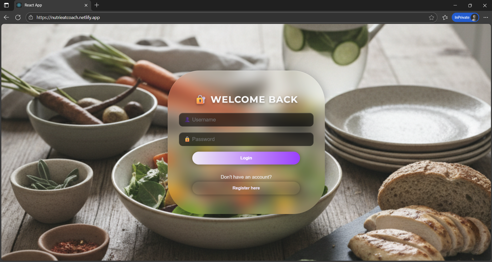
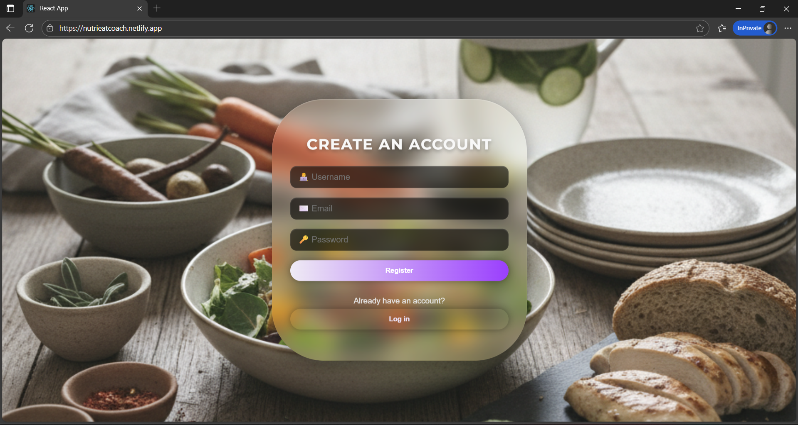
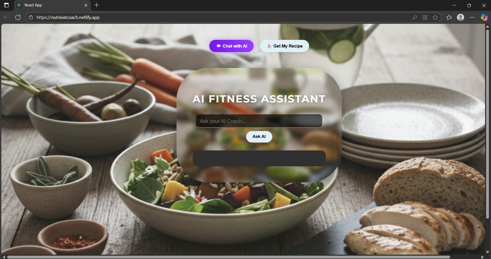
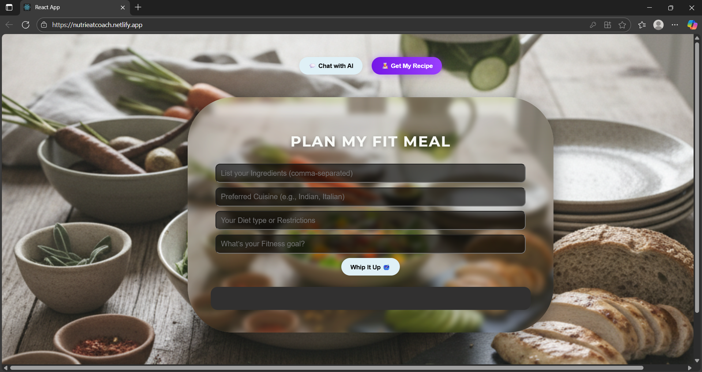

🥗 **NutriEat Coach**
=====================

> **Eat smarter, live healthier — powered by AI.**

### 🌟 **NutriEat Coach is a full-stack AI-driven nutrition assistant that allows users to authenticate securely and receive personalized diet suggestions generated using Spring AI and the OpenAI API. The system is built with a clean separation between a React frontend and a Spring Boot backend, with PostgreSQL used exclusively for user login and registration. The backend is containerized with Docker and deployed on Render, while the frontend is hosted on Netlify, providing a production-ready, scalable setup ideal for showcasing full-stack development, deployment, and AI integration.**


📚 **Table of Contents**
========================

*   Tech Stack
    
*   Features
    
*   Project Structure
    
*   Environment Variables
    
*   Run Locally
    
*   API Endpoints
    
*   Deployment Links
    
*   Screenshots
    
*   Contact
    
*   License
    
*   Acknowledgements
    
*   Final Notes
    

🧰 **Tech Stack**
=================

**Frontend**: React, JavaScript, HTML/CSS

**Backend**: Spring Boot, Spring AI, Java

**Database**: PostgreSQL

**AI Integration**: Spring AI + OpenAI API

**Backend**: Docker container hosted on Render

**Frontend**: Netlify

**Tools**: Maven, Git, GitHub, Postman, Docker

✨ **Features**
==============

### 🤖 **AI-Powered Recommendations**

Personalized diet suggestions using Spring AI + OpenAI API.

### 🔐 **User Authentication**

Secure login and registration using Spring Boot.

### 💻 **Interactive UI**

Modern, responsive React interface.

### 🔗 **REST API Integration**

Cleanly structured Spring Boot endpoints.

### 🗄️ **Persistent Storage**

PostgreSQL stores user data.

### 🔧 **Environment-Based Configuration**

API keys, DB credentials, and deployment configs separated.

### 🚀 **Production Deployment**

Backend using Docker on Render, frontend on Netlify.

🗂️ **Project Structure**
=========================

NutriEat-Coach-Fullstack/

│

├── frontend/                     # 🎨 React frontend

│   ├── public/

│   ├── src/

│   └── package.json

│

├── backend/                      # ⚙️ Spring Boot backend

│   ├── src/

│   │   ├── main/

│   │   │   ├── java/             # 💻 Java source code

│   │   │   └── resources/        # 🔐 application.properties (ignored)

│   │   └── test/

│   ├── pom.xml

│   └── Dockerfile

│

├── assets/                       # 🖼️ Screenshots for README

│   ├── Login.png

│   ├── Register.png

│   ├── Chat.png

│   └── GetMyRecipe.png

│

├── .gitignore

└── README.md


🔑 **Environment Variables**
=======================

To run this project, the following environment variables must be configured. 

**🟦 Backend (Spring Boot — application.properties)**

Create a file named
```bash
    application.properties
```
```bash
Inside: backend/src/main/resources/
```
Add the required variables: 

```bash
    spring.datasource.url=<YOUR_POSTGRES_URL> 
    spring.datasource.username=<YOUR_DB_USERNAME> 
    spring.datasource.password=<YOUR_DB_PASSWORD> 
    openai.api.key=<YOUR_OPENAI_API_KEY>
```
    
**🟩 Frontend (React)** 

Create a .env file inside the frontend directory:
    frontend/.env 
    
Include: 
```bash
    REACT_APP_BACKEND_URL=<YOUR_BACKEND_API_URL> (Additional keys can be added if required.)
```
    
**🌐 Deployment Environment Variables**

**Backend (Render)**

Configure the following in Render's environment settings: 
```bash
    SPRING_DATASOURCE_URL
    SPRING_DATASOURCE_USERNAME 
    SPRING_DATASOURCE_PASSWORD 
    OPENAI_API_KEY
```
**Frontend (Netlify)**

Configure the following in Netlify environment settings: 

```bash
    REACT_APP_BACKEND_URL
```
    


🛠️ **Run Locally**
===================

**1. Clone the Repository**

```bash
    git clone https://github.com/rithish03/NutriEat-Coach-Fullstack
```

Go to the project directory

```bash
  cd NutriEat-coach-Fullstack
```

**Backend Setup (Spring Boot)** 

**2. Navigate to the Backend Directory**

```bash
    cd backend
```

**3. Install Dependencies**

```bash
    mvn clean install
```
**4. Configure Environment Variables** 

Create:

```bash
    src/main/resources/application.properties
```

Add:

```bash
    spring.datasource.url=<YOUR_POSTGRES_URL> 
    spring.datasource.username=<YOUR_DB_USERNAME> 
    spring.datasource.password=<YOUR_DB_PASSWORD> 
    openai.api.key=<YOUR_OPENAI_API_KEY>
```

**5. Run the Backend**

```bash
    mvn spring-boot:run
```

The backend will start on: 

```bash
    http://localhost:8080
```

**💻 Frontend Setup (React)**

**6. Navigate to the Frontend Directory**
```bash
    cd frontend
```

**7. Install Dependencies**
```bash
    npm install
```

**8. Configure Environment Variables** 

Create:
```bash
.env
```
Add:
```bash
REACT_APP_BACKEND_URL=http://localhost:8080
```

**9. Run the Frontend**
```bash
    npm start
```

The frontend will start on: http://localhost:3000 


📡 **API Endpoints**
=======================

**Base URL** 

**For development (local):**

```bash
http://localhost:8080
```

**For production (Render):**
```bash
https://nutrieatcoach.netlify.app/ 
```

**👤 Authentication Endpoints**

**Register User**

```bash
POST /api/auth/register
```

**Body (JSON):**
```bash
{
  "username": "example",
  "email": "example@mail.com",
  "password": "password123"
}
```

👨🏻‍💻 **Login User** 
```bash
POST /api/auth/login 
```

**Body (JSON):**
```bash
{
  "email": "example@mail.com",
  "password": "password123"
}
```

**Response (example):**
```bash
{
  "message": "Login successful",
  "userId": "12345"
}
```

**🤖 AI Recommendation Endpoint** 

**Get Diet Suggestions** 
```bash
POST /api/ai/suggestions 
```
**Body (JSON):**
```bash
{
  "query": "Suggest me a healthy diet plan for weight loss."
}
```

**Response (example):**
```bash
{
  "suggestion": "Here is a balanced weight-loss diet plan..."
}
```

This endpoint uses Spring AI + OpenAI API to generate personalized responses. 

🌍 **Deployment Links** 
=======================

**🌐 Frontend (Netlify)**

**Live Site:** 
```bash
https://nutrieatcoach.netlify.app/
```

**🟦 Backend (Render)**

**API Base URL:**
```bash
https://nutrieatcoach-backend-deployment-latest.onrender.com
```

**📁 Source Code Repository** 

**GitHub:**
```bash
https://github.com/rithish03/NutriEat-Coach-Fullstack
```

🖼️ **Screenshots**
===================

   


📞 **Contact**
==============

**Name:** Rithish

**Email:** rithishrattan@gmail.com

**LinkedIn:** [https://linkedin.com/in/rithish-rattan](https://linkedin.com/in/rithish-rattan)

**GitHub:** [https://github.com/rithish03](https://github.com/rithish03)

📜 **License**
==============

This project is intended solely for educational and portfolio purposes.Unauthorized commercial use, redistribution, or modification is not permitted.

🙌 **Acknowledgements**
=======================

*   Spring AI
    
*   React
    
*   Spring Boot
    
*   PostgreSQL
    
*   Docker
    
*   Render & Netlify
    
*   Open-source community ❤️
    

🧠 **Final Notes**
==================

NutriEat Coach was developed as a full-stack project exploring AI integration, backend–frontend architecture, and real-world deployment. More improvements will be added in the future.

🌱 **Remember — eating healthy is not just a choice, it’s a lifestyle!** 💚
---------------------------------------------------------------------------
